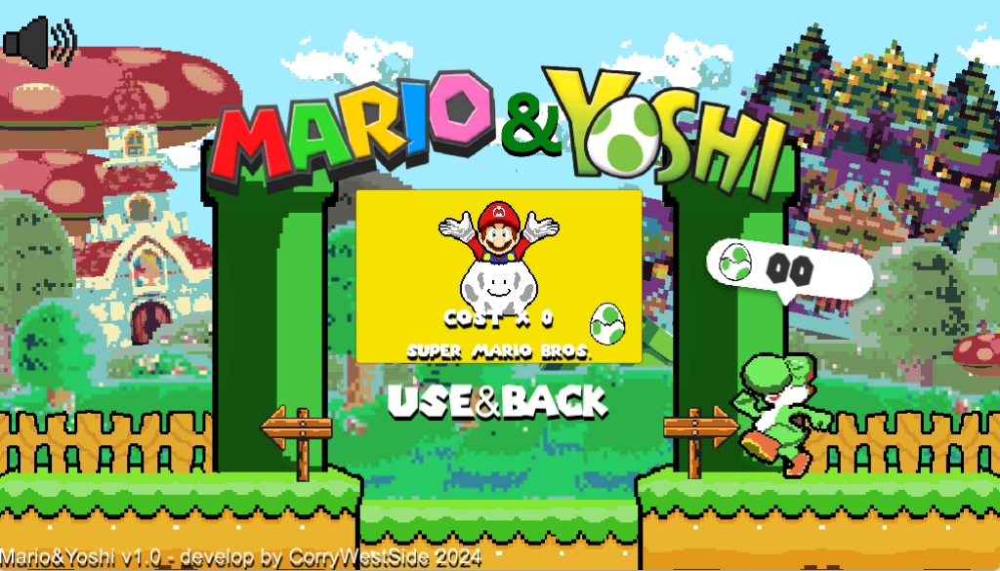
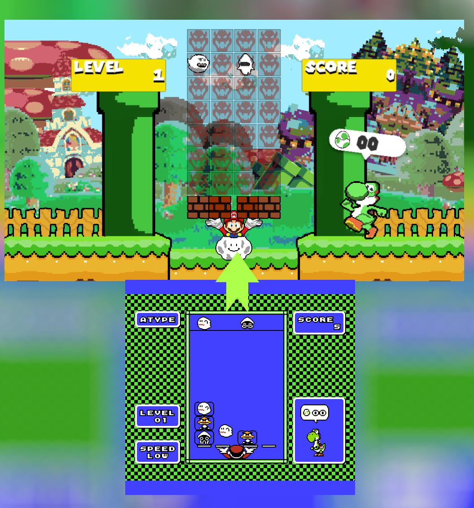
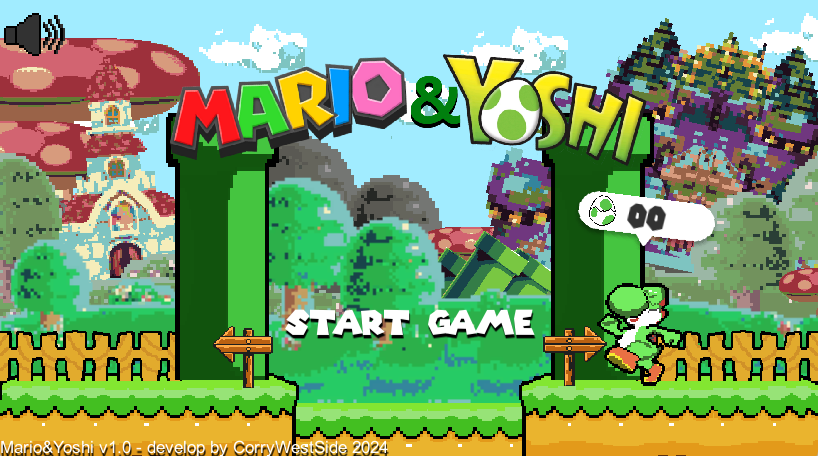
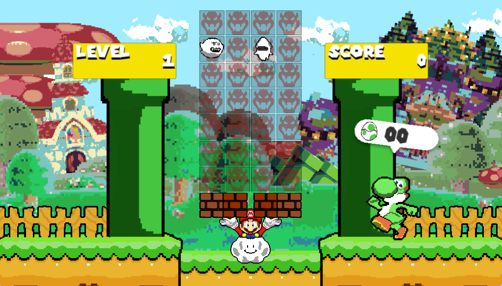

# Mario&Yoshi Remake

## About
"Mario&Yoshi Remake"  is one of those crazy ideas that come to mind every now and then... Let me start by saying that the game still has a few bugs, but I can tell you that I finished it in just 5 days, with scripts, pixel art graphics all redone by me. I apologize for any issues. The game replicates exactly the mechanics of the old NES title but simply with improved graphics and especially with a neat addition of skins. In the future, I intend to improve it, but only if it gains success. For now, take it as a fun game and also as a tribute to the great Nintendo.

## The Game
It is exactly like its predecessor. Mario will move left and right with A and D, and with Enter, he will change the platforms on which the enemies will fall. If two enemies align vertically, they will disappear. The goal is to last as long as possible and collect Yoshi's eggs. I thought of using the eggs as currency to purchase skins.

## Instructions for use

- **Download the Zip file**

- **Extract all file in a folder**

- **Play it!*

  ## Comman

- **A and D key for move**
 
- **Enter for interact**  

## Screenshots

## Download

- **Mario&Yoshi Remake**  you just can download the software with this follow Link
[Mario&Yoshi.exe](https://corryws.itch.io/marioyoshiremake)

## Contact

For more information or to request a demo, please contact us at corradotrigilia97@gmail.com | c.trigilia@sisoftsrl.it or visit our website at https://corryws.itch.io
